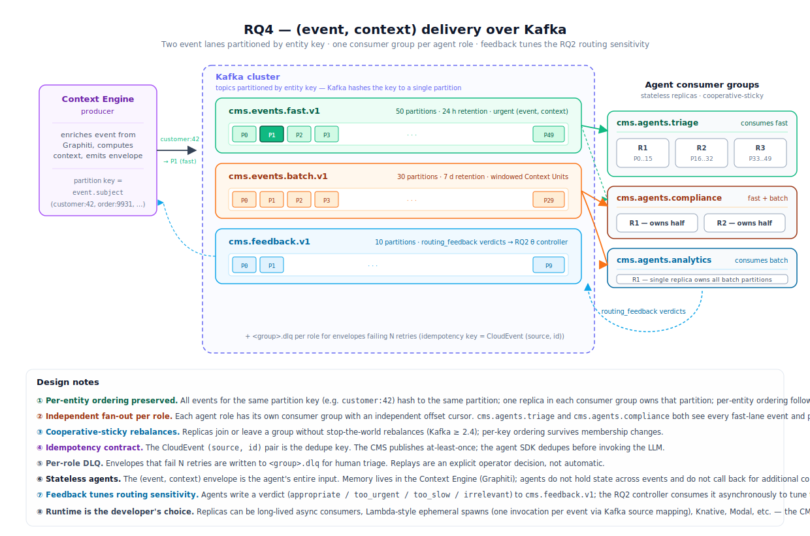

# Thesis Proposal — Open-Source Context Engine for Streaming AI Agents

## Prior art: Confluent Real-Time Context Engine (closed source)

A commercial system with this exact architectural shape already exists: Confluent's **Real-Time Context Engine (RTCE)**, currently Early Access on Confluent Cloud.


*Website/mobile/CDC events stream into Kafka, Flink jobs materialise per-entity context views (CUSTOMER360, ORDERS), and an LLM agent retrieves them at inference time.* RTCE is **proprietary**, Early Access, and its agent interface is **pull-only** over MCP — the agent must ask; it is never notified. Tableflow (the Iceberg/Delta materialisation layer) is likewise proprietary.

## Problem statement

> **AI agents operating over high-volume heterogeneous event streams (Slack, JIRA, e-commerce telemetry, …) need a context management system that delivers the right context at the right time, with business-critical events pushed immediately — and no open-source reference architecture or protocol exists for this.**

## Architectural commitments

Two opinionated stances frame the rest of the proposal; reviewers should read the diagram with both in mind.

**Stateless agents — the CMS owns every token that reaches an LLM.** Agents are pure functions: their *entire* input is a single `(event, context)` envelope produced by the CMS, and their output is an action. There is no agent-side memory, no in-process cache, and no runtime callback into the engine to fetch additional context. All long-lived state (entity timelines, relations, recently-believed facts) lives inside the Context Engine, in [Graphiti](https://github.com/getzep/graphiti). This collapses two otherwise-tangled responsibilities — *deciding what context an agent needs* and *running an agent* — onto opposite sides of a clean contract.

**Generalizable delivery via Kafka.** Enriched `(event, context)` envelopes are produced to Kafka topics partitioned by entity key. Developers consume them with whatever runtime fits their workload — a long-lived async consumer, a Lambda-style ephemeral spawn, k8s, Modal, anything that speaks Kafka. The CMS does not dictate the agent runtime, language, or framework. MCP is used *internally to the engine* for the Graphiti memory layer, but the agent-facing edge is Kafka, not MCP. The trade-offs against MCP-streaming push and MCP-pull surfaces are surveyed in RQ4 below.

## Proposed architecture


*Heterogeneous events enter the Context Management System and are first routed by an Event Classification stage onto a fast lane (urgent, signal-grade) or a batch lane (aggregated Context Units) — a latency split, not a Lambda-style dual codebase. The Context Engine indexes events into Graphiti, materialises per-entity views, computes the `context` object per outgoing event, and produces `(event, context)` envelopes onto partitioned Kafka topics. Agents are stateless consumers of those topics — events are routed to the right agent by partition key.*

**Processing note.** Both lanes flow through the same indexing path inside the Context Engine; only the *moment of publish* differs (fast = on arrival, batch = at window close). The per-event pipeline — Graphiti episode write (in-memory, FalkorDB-backed), context computation, envelope emission — is described in *Context Engine — internal architecture* below.

## Context Engine — internal architecture

The Context Engine is the box inside the dashed CMS boundary that turns a raw classified event into the `(event, context)` envelope that ends up on Kafka. Four concerns:

**Memory layer — Graphiti, in-memory.** The engine uses [Graphiti](https://github.com/getzep/graphiti) — the open-source implementation of the Zep architecture (Rasmussen et al., *Zep: A Temporal Knowledge Graph Architecture for Agent Memory*, arXiv:2501.13956) — as its bitemporal temporal-knowledge-graph backing store. Each ingested event is written as a Graphiti *episode*; Graphiti automatically extracts entities and relations, attaches `valid_from` / `invalidated_at` edges, and supersedes contradicted facts. This gives the engine native bitemporal recall ("what did we believe about customer X at time t?") without bespoke versioning code. Graphiti is run on **FalkorDB** (a Redis-backed in-memory graph database that Graphiti supports as a backend) so all hot-path context queries hit RAM; durability comes from Redis's standard persistence (RDB snapshots + AOF). Cold-tier event storage (audit log, archived raw events past the working set) lives separately in Paimon / Iceberg, but the Graphiti graph itself stays exclusively in FalkorDB — there is no second graph backend in v1. *No hand-rolled "materialised view" cache layer is maintained on top* — Graphiti is the single source of truth for memory state, and FalkorDB is the in-memory execution engine. The detailed rationale and trade-off survey for Graphiti as the memory primitive is in `research/RQ5-shared-memory.md`.

*Scope note on memory scaling.* FalkorDB is single-node (Redis-style) and therefore scales vertically only. The thesis accepts this ceiling for v1: the reference implementation runs a single FalkorDB instance, and benchmarks operate within its working-set capacity. Horizontal scaling — sharding the Graphiti graph across a Redis Cluster keyed by entity-id, or a comparable scheme — is explicitly **future work**. It is non-trivial because graph traversals don't shard cleanly across Redis hash slots, but the rest of the architecture is shard-friendly (events are already partitioned by entity key in Kafka), so the eventual sharding boundary aligns naturally with the existing partition key. Surveying that sharding design — and whether FalkorDB's roadmap, an alternative Graphiti backend, or a custom routing layer is the right primitive — is left for a follow-on study.

**Context computation at publish time.** For every outgoing event, the engine queries Graphiti for the partition key's *current entity state*, the *last N events* on that key, and *relevant facts* pinned to the event time. The result is the `context` half of the envelope. Because Graphiti runs in-memory, these queries are sub-millisecond on the hot working set. This is the work the engine performs that lets agents stay stateless — the LLM never has to call back to a memory store mid-turn.

**Authorisation + filtering.** The engine is the single authorisation boundary. Tenant and session scoping are applied to the `context` object *before* publish, not on the agent side. An agent process that subscribes to a Kafka topic for `tenant:acme` cannot see events whose authorisation predicates exclude that tenant — the engine simply will not have produced them onto a topic the agent has access to.

### The `(event, context)` envelope

The contract between the CMS and any agent is a single JSON envelope. Bumping it is a versioned migration; agents pin a version.

```jsonc
{
  "schema":  "cms/event-context/v1",
  "event":   {
    // CloudEvents v1.0 envelope
    "source":  "...",
    "id":      "...",
    "type":    "...",
    "subject": "customer:42",
    "time":    "...",
    "data":    { /* event payload */ }
  },
  "context": {
    "entity_state":   { /* current per-key snapshot from Graphiti */ },
    "recent_events":  [ /* last N events for the same partition key */ ],
    "relevant_facts": [ /* graph-queries pinned to event.time */ ]
  }
}
```

The `event.subject` field doubles as the Kafka partition key, guaranteeing per-entity ordering across consumers in the same group.

## Research questions

- **RQ1 — Streaming architecture.** Lambda vs Kappa vs Kappa+/Streamhouse for a context engine feeding agents? *[see `research/RQ1-lambda-vs-kappa.md`]*
- **RQ2 — Event classification.** Per-event fast/batch routing via **per-entity, label-free anomaly detection** (Cloudflare-inspired), not supervised urgency classification. *[reframe in `research/RQ2-anomaly-detection-reframe.md`; original survey in `research/RQ2-event-classification.md`]* — pipeline below.
- **RQ3 — Aggregation.** Events for the same entity (e.g. customer id) are grouped together and released to the next stage on a windowed timeframe. *[see `research/RQ3-batch-aggregation.md`]*
- **RQ4 — Delivery surface.** What protocol carries the `(event, context)` envelope from the engine to a stateless agent? Decision: Kafka direct, partitioned by entity key — surveyed against MCP Streaming push, MCP pull, and the broader landscape. *[see `research/RQ4-context-distribution.md` + `research/push-protocol/report.md`]*

## RQ2 — Event classification: per-entity anomaly detection


The earlier draft framed routing as **supervised urgency classification** — a calibrated `p(urgent)` classifier (LightGBM/XGBoost) plus a contextual bandit that *learned urgency* from downstream agent verdicts. That framing is abandoned. It is structurally ill-posed (no independent urgency labels exist — the only signal is delayed, selection-biased, policy-dependent agent feedback) and it does not scale: a single global model is a *centralized* learner bolted onto a *partitioned* streaming architecture, retrained as sources/entities/drift grow. The full critique and literature are in `research/RQ2-anomaly-detection-reframe.md`; the evaluation in `research/evaluation-methodology.md`.

The replacement, inspired by how Cloudflare detects DDoS/anomalies at scale (per-customer adaptive baselines, deviation *scoring* not labeled classification, customer-tunable sensitivity, ~1M unsupervised models/day), is **per-entity, label-free streaming anomaly detection**, two-level by `(entity × source-type)`:

- **Entity = the CloudEvent `subject`** (`customer:42`, `service:checkout`) keys the baseline — which is *already* the Kafka partition key and Flink `keyBy`, so anomaly state shards along the axis the system already scales on.
- **Feature schema per source-type** — a Slack/JIRA/telemetry feature extractor; adding a source is a new extractor (+ optional rules), never a global retrain.

**How it works:**

- **Stage 1 — Envelope.** Per-source adapter wraps each event in a CloudEvents v1.0 envelope and extracts features — Layer A (source-agnostic: inter-arrival gap, event-type mix, actor entropy, novelty, time-of-day) and Layer B (source-specific). Volume-decoupled *ratios/compositions* are preferred over raw counts (Cloudflare's "top-5 browser proportion" trick) so legitimate spikes don't false-positive. Essentially free (<1 ms).
- **Stage 2 — Rules (hard floor).** A small JsonLogic/Drools set (JIRA P0, Slack @oncall, Stripe dispute ≥ $N, PagerDuty incident) forces FAST. Re-cast from "short-circuit" to the **mandatory floor** for the *urgent-but-not-anomalous* class a detector provably misses.
- **Stage 3 — Per-entity anomaly scorer.** Features enter already transformed *relative to the entity's own baseline* (robust z `(x−median)/MAD`; compositional JS/KL divergence). Default scorer is **HBOS** (`HBOS(p)=Σ log 1/hist_i(p)` — linear-time, mixed-type, *no per-entity covariance matrix*, scales to millions of entities) plus univariate **robust-z / Page-Hinkley** for the point/local deviations HBOS misses; **PCA+Mahalanobis** reserved as a per-source-type upgrade where features are correlated. Baselines live in Flink keyed state next to Graphiti — 5-min buckets, ~4-week window, daily refresh.
- **Stage 4 — Decision (OR-gate + guards).** `route_to_fast = Rules(e) OR (s_anom > θ_source)`, past an **absolute-volume floor** and **multi-window confirmation** (short 5-min AND long 1–4 h must both cross — Google SRE multi-burn-rate). A *point* anomaly sends that event; a *window* anomaly emits one deduped **situation envelope**, not every raw event. The continuous score also ranks salience inside the batch lane.
- **Agent feedback — tunes sensitivity, not a classifier.** Agents still write `{event_id, verdict}` (`verdict ∈ {appropriate, too_urgent, too_slow, irrelevant}`) to `cms.feedback.v1`. The verdict is now a **slow control signal** that nudges the per-source threshold `θ_source` (Cloudflare-style sensitivity levels) — `too_urgent` raises θ, `too_slow` lowers it — not a label that trains a model. A per-source EWMA/PID controller suffices; no labels, no nightly retrain.

**Runtime behaviour:**

| Event | Per-entity signal | Guard / rule | Action | Agent verdict | θ effect |
|---|---|---|---|---|---|
| Stripe dispute $50K on `customer:42` | order-value z ≫ customer's normal | past floor | **fast** (point anomaly) | `appropriate` | — |
| Slack @oncall in `#incidents` | — | rule match | **fast** (rule floor) | — | scorer never consulted |
| JIRA P0 on a daily-P0 service | not anomalous (expected) | rule match | **fast** (rule floor) | `appropriate` | detector alone would miss it |
| `#random` chit-chat on `channel:random` | within baseline mix | — | **batch** | `appropriate` | — |
| Error burst on `service:checkout` | event-type mix shift, both windows cross | past floor + multi-window | **fast** (one situation envelope) | `appropriate` | — |
| Verbose log blip on `service:logs` | short window crosses, long doesn't | fails multi-window | **batch** | — | would-be `too_urgent` averted |
| New `channel:launch` first message | novelty high, abs volume tiny | fails absolute floor | **batch** | — | unchanged |

## RQ4 — Delivery surface for stateless agents

Given the architectural commitments above (CMS owns context; agents are stateless), RQ4 reduces to: *which protocol carries the `(event, context)` envelope from engine to agent?* Three plausible families exist — a streaming push protocol over the LLM-tooling stack (MCP Streaming Resources), a pull/polling protocol over the same stack (Confluent RTCE's actual interface today), or a brokered event bus that stays out of the LLM-tooling stack entirely (Kafka). The proposal commits to the third.

### Decision: Kafka direct



The Context Engine produces `(event, context)` envelopes onto Kafka topics partitioned by entity key. Concrete conventions:

- **Topics — split by lane.** `cms.events.fast.v1` (24 h retention, urgent events) and `cms.events.batch.v1` (7 d retention, windowed Context Units). Agent → engine feedback flows on `cms.feedback.v1`, where agents write `routing_feedback` verdicts that tune the RQ2 per-source anomaly sensitivity (`θ_source`).
- **Partition key.** The CloudEvent `subject` field (`customer:42`, `order:9931`, `tenant:acme`). Kafka hashes the key to a single partition, so per-entity ordering is preserved across the consumer group. Cross-entity ordering is *not* preserved — agents only ever care about per-entity timelines.
- **Partition count.** 50 for fast, 30 for batch. Sized for peak parallelism; over-provisioned because partition count is hard to change live.
- **Consumer groups — one per agent role.** `cms.agents.triage`, `cms.agents.compliance`, `cms.agents.analytics`. Multiple roles on the same topic give independent fan-out with separate offset cursors. Within a role, replicas share partitions via the cooperative-sticky assignor (Kafka ≥ 2.4) to avoid stop-the-world rebalances.
- **Idempotency.** The CloudEvent `(source, id)` pair is the dedupe key. The CMS guarantees at-least-once; agents dedupe.
- **DLQ.** `<group>.dlq` per role for envelopes that fail N retries.

Developers consume from these topics with whatever runtime fits the workload — a long-lived async consumer process, a Lambda-style ephemeral spawn (one invocation per event), Knative, Modal, anything that speaks Kafka. The CMS does not dictate.

### Alternative considered — MCP Streaming Resources push

An earlier draft of this proposal centred a content-bearing extension of MCP's `resources/subscribe` + `notifications/resources/updated` over Streamable HTTP, with `flow/*` back-pressure and `Last-Event-ID` resumability. The protocol is a clean fit for LLM-tooling-native agents and could be submitted as an MCP SEP. It is **rejected as the primary surface** for three reasons:

- **Scalability.** Long-lived SSE / Streamable-HTTP connections impose per-connection memory and event-loop cost that scales worse than Kafka consumer-group fan-out for the subscriber counts a CMS will see. `research/push-protocol/report.md:318` flagged this as an explicit open problem; `research/push-protocol/04-push-delivery-semantics.md` enumerates the production patterns — Kafka groups, MQTT 5 `$share/`, AMQP shared subscriptions — that exist precisely to side-step single-connection-per-subscriber.
- **Generalizability.** Forcing every adopter onto an MCP client narrows the runtime universe; Kafka is everywhere.
- **Failure-mode complexity.** Replay via `Last-Event-ID` is a bespoke server-state contract; Kafka offsets are a well-understood broker-state contract.

Future work *can* add an MCP-push façade *on top of* the Kafka spine — a server that consumes from `cms.events.*` and re-emits as `notifications/resources/updated` — as a convenience surface for agents already in the MCP ecosystem. It would not be on the critical path.

### Alternative considered — MCP pull / polling (RTCE baseline)

The agent calls `resources/read` against a CMS-side MCP server on a schedule. This is the public state-of-the-art today — Confluent RTCE's only agent interface (`research/confluent-rtce-deep-dive.md`). Rejected because polling either wastes calls during quiescence or lags the fast-path SLA on bursty traffic. The whole point of RQ4 is to close the push gap RTCE leaves open; a polling baseline would re-open it.

### Other alternatives surveyed and discarded

Briefly, with citations into the research notes:

- **NATS JetStream durable consumers** — viable, but doesn't beat Kafka on the dimensions that matter here (`research/push-protocol/04-push-delivery-semantics.md:144–154`). One broker is enough.
- **MQTT 5 shared subscriptions** — competing-consumer pattern at scale, but the IoT-protocol baggage (QoS state machines, session expiry) buys nothing for this workload (`04-push-delivery-semantics.md:124–134`).
- **AMQP 1.0** — most complete reliability + native priority, but operational complexity and tooling mass are inferior to Kafka in the data-engineering ecosystem (`04-push-delivery-semantics.md:135–142`).
- **Raw WebSocket / gRPC server-streaming** — isomorphic to MCP Streaming at the transport layer; same per-connection cost story (`04-push-delivery-semantics.md:80–87, 102–109`).
- **A2A push, OpenAI Realtime, AGNTCY SLIM, Temporal Signals** — wrong direction or wrong shape for upstream→agent delivery (`research/push-protocol/02-a2a-and-agent-push-landscape.md`).
- **Webhook → queue → worker** — degenerate ephemeral-Kafka with strictly worse semantics (no replay, retry-only) (`02-a2a-and-agent-push-landscape.md:232–264`).

**References:**

- Apache Kafka — partitioning, consumer groups, cooperative-sticky assignor: <https://kafka.apache.org/documentation/>
- CloudEvents v1.0 specification: <https://github.com/cloudevents/spec/blob/v1.0.2/cloudevents/spec.md>
- Push-protocol literature survey: `research/push-protocol/report.md`
- Confluent RTCE deep-dive: `research/confluent-rtce-deep-dive.md`

## Agent Development Kit

The thesis ships a thin Python SDK alongside the protocol contract. Its purpose is to lower the friction of writing a stateless agent against the `(event, context)` Kafka topic — but it does *not* run business logic, hold state, or manage an LLM. Adopters who prefer a different language drop down to a raw Kafka client; the contract is the contract.

### Subscribing and handling an event

```python
import asyncio
from cms_sdk import CMSClient

async def main():
    cms = CMSClient(
        brokers="kafka:9092",
        group="cms.agents.triage",          # consumer-group name = agent role
    )

    async for ec in cms.subscribe("cms.events.fast.v1"):
        # ec.event   -> typed CloudEvent
        # ec.context -> { entity_state, recent_events, relevant_facts }
        result = await my_llm_call(ec.event, ec.context)
        await ec.feedback("appropriate")    # tunes the RQ2 anomaly sensitivity (θ_source)

asyncio.run(main())
```

What the SDK provides: typed CloudEvent decoding, `context`-object decoding, automatic offset commits on successful feedback, dead-letter handling for envelopes that throw, and a one-liner for `routing_feedback`. Verdict vocabulary: `appropriate`, `too_urgent`, `too_slow`, `irrelevant`.

### Plugging in Claude Code as the agent

The thesis evaluation on ProAgentBench uses **the same SDK loop** with Claude Code as the agent runtime. The shape is identical — only the body of the loop changes:

```python
import asyncio
from cms_sdk import CMSClient
from claude_agent_sdk import query, ClaudeAgentOptions

options = ClaudeAgentOptions(
    system_prompt=(
        "You are a customer-triage agent. Decide what action to take given "
        "the event and its precomputed context. Use the tools available."
    ),
)

async def main():
    cms = CMSClient(brokers="kafka:9092", group="cms.agents.triage")

    async for ec in cms.subscribe("cms.events.fast.v1"):
        prompt = (
            f"Event:\n{ec.event}\n\n"
            f"Context:\n{ec.context}\n\n"
            "Decide and act."
        )
        async for msg in query(prompt=prompt, options=options):
            # stream Claude's responses — log, post to Slack, write back to Graphiti, etc.
            pass

        await ec.feedback("appropriate")

asyncio.run(main())
```

The agent stays stateless: every loop iteration is a fresh `query()` with the complete `(event, context)` payload as the only input. There is no agent-side memory, no cross-event continuation. Memory lives in Graphiti, and Graphiti is queried *by the Context Engine on the producer side*, not by the agent.

### What the SDK is not

- **Not an agent framework.** No router, no tool registry, no memory abstraction. Tools come from whatever runtime the agent uses (Claude Agent SDK, LangGraph, raw Anthropic SDK, …); memory comes from the CMS.
- **Not a lifecycle manager.** The user runs the process — k8s Deployment, Lambda over a Kafka source mapping, Modal, Knative, anything. The SDK is a library, not a platform.
- **Not Python-only at the contract level.** Any language with a Kafka client (Java, Go, Rust, TS) can implement the same `(event, context)` contract. The Python SDK is a convenience for the most common stack, not a requirement.

## Evaluation


The Context Engine is evaluated on **ProAgentBench** — Tang et al., *ProAgentBench: Evaluating LLM Agents for Proactive Assistance with Real-World Data*, arXiv:2602.04482 (Feb 2026) [<https://arxiv.org/abs/2602.04482>]. It is the closest public benchmark to the thesis's target workload.

**What the dataset is:**

- **Scale.** 28,000+ events collected from 500+ hours of *real* user sessions (not LLM-synthesised). Privacy-compliant. Released by the authors under an open licence.
- **Burstiness `B = 0.787`.** The event arrival process is strongly bursty — clumps of activity separated by quiet periods — as opposed to synthetic Poisson streams where `B ≈ 0`. The paper's core finding is that synthetic streams fail to capture authentic human decision patterns, so this property must be preserved.
- **Hierarchical task framework:**
  - *Task 1 — Timing prediction.* Given the event stream up to time *t*, decide whether the agent should intervene now. Isomorphic to our RQ2 `{fast, batch}` routing decision.
  - *Task 2 — Assist content generation.* Given an intervention window, produce the assistance text. Exercises our Context Unit shape (RQ3) and Kafka-direct delivery of `(event, context)` envelopes (RQ4).
- **Metrics.** Appropriateness and timeliness of proactive suggestions. Maps cleanly onto our `routing_feedback` verdict vocabulary (`appropriate` / `too_urgent` / `too_slow` / `irrelevant`).
- **Baselines.** LLM- and VLM-based agents evaluated in the paper, with the finding that long-term memory + historical context lift prediction accuracy — which is the exact argument for maintaining the Context Engine's materialised views.

**How we use it** (full four-layer metric framework, experiment matrix, and statistical-rigor protocol in `research/evaluation-methodology.md`):

1. **L1 — offline routing quality.** The fast path is scored as *streaming anomaly detection*, not point classification: headline **VUS-PR** and **affiliation-F1** (PA-resistant), NAB latency score under the `reward_low_FN_rate` profile, recall@FPR≤1%. Naive point-adjusted F1 is explicitly avoided — Kim et al. (AAAI 2022) show a random scorer "wins" under it.
2. **L2 — online routing under drift + system load.** Replay the stream *prequentially*; measure prequential AUC, cumulative regret vs. oracle routing, doubly-robust off-policy estimates, calibration (ECE/Brier), and drift detection-delay/recovery — alongside system metrics (p99/p99.9 event-time latency-to-agent, sustainable throughput, consumer/watermark lag, recovery time).
3. **L3 — head-to-head delivery benchmark.** Same workload replayed into three backends — RTCE (pull-only over MCP), Confluent Streaming Agents (in-pipeline push, proprietary), our Context Engine (Kafka-direct envelopes) — measuring latency-to-agent (p50–p99.9, coordinated-omission-corrected), missed events, and counterfactually-defined token waste from `too_urgent` misrouting. Poll interval is swept; report the latency/cost/staleness Pareto.
4. **Burstiness ablation.** Flatten the distribution to `B ≈ 0` (same event set) and re-run; quantify how much of the engine's advantage is justified only under real burstiness (`B = 0.787`).
5. **Lc — context-retrieval quality.** The Context Engine's core job — assembling the right `(event, context)` — is scored *process-oriented*, grounded in **ContextBench** (arXiv:2602.05892): **context recall / precision / F1** and *assembly drop* of the served envelope against a per-event gold context (the Graphiti facts truly required to act), with the gold-context annotate→verify→minimise protocol retargeted to the event-stream domain. Composed with LongMemEval/LoCoMo retrieval probes.
6. **Burst & scalability of RQ2 + RQ4.** Generate a replayable stream at a target burstiness (Pareto ON/OFF superposition, finite-size-corrected `A_n`; Fano/Hurst cross-checks) and measure scalability the **Theodolite** way — resource *demand to sustain a load intensity*, swept over events/s × entity cardinality × partitions — proving per-entity state shards on the partition key. The headline burst result: FAST-lane urgent-event **p99.9 SLO attainment vs. offered load**, two-lane minus single-lane gap plotted against `B`, with the *self-DoS* risk (burst-is-the-anomaly) measured and the routing guards shown to act as load shedding. (Full methodology, metrics, and experiment matrix E9–E11 in `research/evaluation-methodology.md` §8.)

## Deliverables

1. **Thesis report** (this document's parent) synthesising RQ1–RQ5.
2. **`(event, context)` Kafka-delivery contract** — JSON Schema for the envelope plus per-topic conventions (naming, partitioning, consumer-group rules, idempotency, DLQ). The architectural specification an open-source CMS implementation must conform to. Replaces the earlier MCP Streaming Resources profile draft.
3. **Reference Context Engine implementation** — open-source, backed by a free-tier streaming stack (Redpanda + Flink + Paimon) and Graphiti for the memory layer, producing `(event, context)` envelopes onto Kafka topics.
4. **Python SDK for agent authors** — thin Kafka consumer + envelope decoder + `routing_feedback` helper. Lets developers write a stateless agent against the contract in a few lines; raw Kafka clients in any language remain a first-class option.
5. **Empirical evaluation on ProAgentBench** — Tang et al., *ProAgentBench: Evaluating LLM Agents for Proactive Assistance with Real-World Data*, arXiv:2602.04482 (Feb 2026). <https://arxiv.org/abs/2602.04482>
   - 28,000+ events from 500+ hours of real user sessions with preserved bursty interaction patterns (burstiness `B = 0.787`), not LLM-synthesised.
   - Hierarchical tasks: (i) **timing prediction** — when to intervene — maps directly onto our RQ2 fast-vs-batch routing decision; (ii) **assist content generation** — what to deliver — exercises our Context Unit shape (RQ3) and Kafka-direct delivery of `(event, context)` envelopes (RQ4).
   - Metrics already match the loop we need: timing appropriateness + assist-content quality ≈ our `routing_feedback` verdict vocabulary (`appropriate` / `too_urgent` / `too_slow` / `irrelevant`).
   - Real-event-stream data (vs. synthetic) also directly validates the paper's finding that long-term memory + historical context lift prediction accuracy — which is exactly what the Context Engine's materialised views are for.
