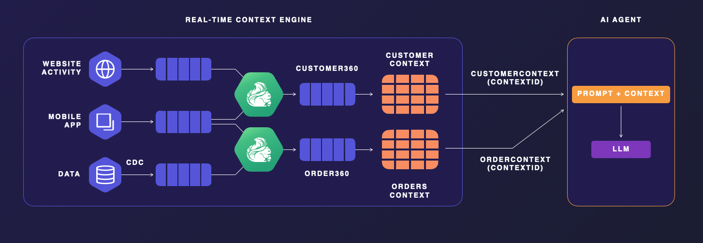
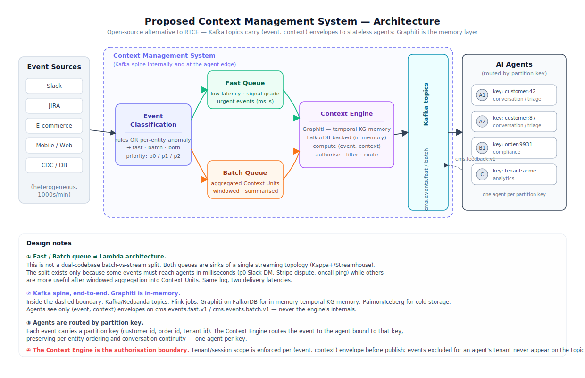
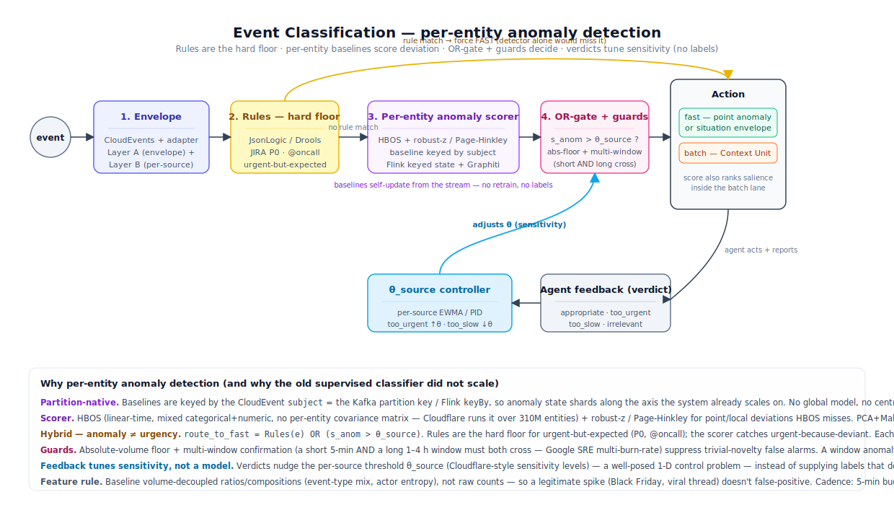
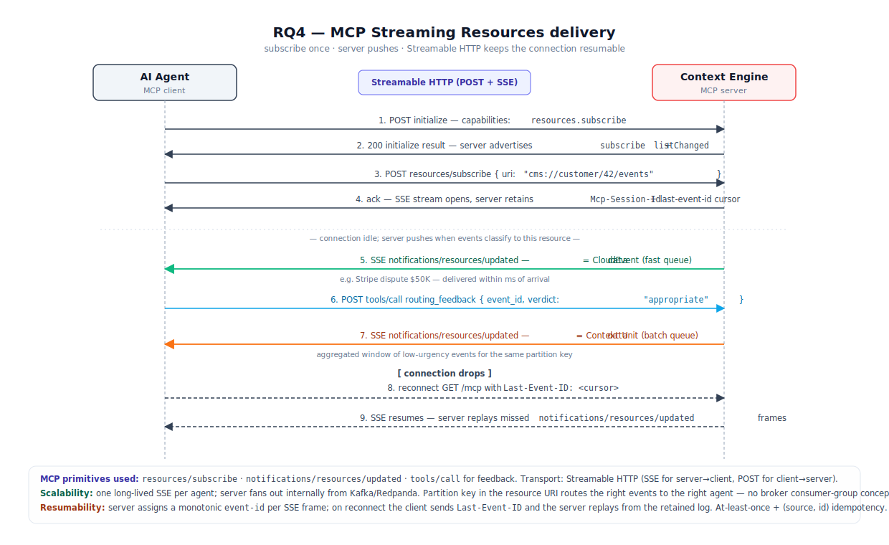
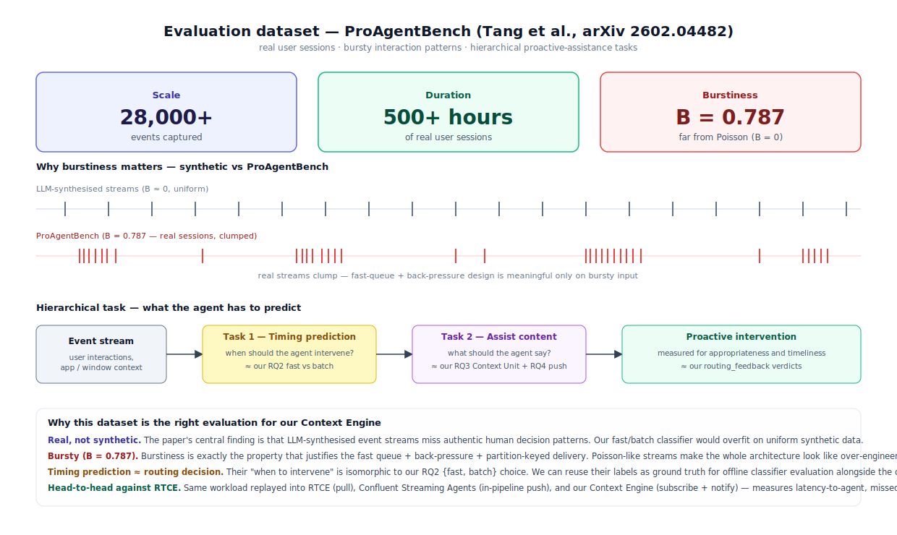

# Thesis Proposal — Open-Source Context Engine for Streaming AI Agents

## Prior art: Confluent Real-Time Context Engine (closed source)

A commercial system with this exact architectural shape already exists: Confluent's **Real-Time Context Engine (RTCE)**, currently Early Access on Confluent Cloud.

*Website/mobile/CDC events stream into Kafka, Flink jobs materialise per-entity context views (CUSTOMER360, ORDERS), and an LLM agent retrieves them at inference time.* RTCE is **proprietary**, Early Access, and its agent interface is **pull-only** over MCP — the agent must ask; it is never notified. Tableflow (the Iceberg/Delta materialisation layer) is likewise proprietary.

## Problem statement

> **AI agents operating over high-volume heterogeneous event streams (Slack, JIRA, e-commerce telemetry, …) need a context management system that delivers the right context at the right time, with business-critical events pushed immediately — and no open-source reference architecture or protocol exists for this.**

## Proposed architecture

*Heterogeneous events enter the Context Management System and are first routed by an Event Classification stage onto a fast queue (urgent, signal-grade) or a batch queue (aggregated Context Units) — a latency split, not a Lambda-style dual codebase. The Context Engine materialises per-entity views, owns filtering and authorisation, and exposes a single MCP Streaming Resources interface. Agents never touch the internal event bus; they subscribe via MCP and events are routed to the right agent by partition key.*

**Processing note.** Events from *both* queues — fast and batch — are processed asynchronously along the same path: indexed into Zep for semantic / temporal recall, and simultaneously written to an in-memory materialised view that serves as the hot read surface. The in-memory view is periodically flushed to the main database. The queue choice only determines *when agents are notified* (fast = push on arrival, batch = delivered as an aggregated Context Unit); the indexing + view-building work happens regardless.

## Research questions

- **RQ1 — Streaming architecture.** Lambda vs Kappa vs Kappa+/Streamhouse for a context engine feeding agents? *[see `research/RQ1-lambda-vs-kappa.md`]*
- **RQ2 — Event classification.** How to decide, per event, whether it belongs on the fast path, the batch path, or both? *[see `research/RQ2-event-classification.md`]* — detailed pipeline below.
- **RQ3 — Aggregation.** Events for the same entity (e.g. customer id) are grouped together and released to the next stage on a windowed timeframe. *[see `research/RQ3-batch-aggregation.md`]*
- **RQ4 — Distribution.** Delivery is based on MCP's `resources/subscribe` + `notifications/resources/updated` pattern over Streamable HTTP for scalability. *[see `research/RQ4-context-distribution.md` + `research/push-protocol/report.md`]*

## RQ2 — Proposed classification pipeline

**How it works:**

- **Stage 1 — Envelope.** Every ingested event is wrapped in a CloudEvents v1.0 envelope by a per-source adapter. Extracts structured features (source, type, time, priority hints, subject, tenant). Essentially free (<1 ms).
- **Stage 2 — Declarative rules.** A small, auditable rule set (JsonLogic / Drools) short-circuits the obvious patterns — JIRA P0, Slack @oncall, Stripe dispute ≥ $N, PagerDuty incident — straight to the routing action. Keeps the bandit's exploration budget focused on the genuinely ambiguous events.
- **Stage 3 — Calibrated classifier.** LightGBM / XGBoost on envelope features (plus an optional small text embedding). Emits `p(urgent)` and a calibrated uncertainty estimate. CPU-only, p95 < 5 ms. Trained offline.
- **Stage 5 — Contextual bandit.** LinUCB or Thompson Sampling (Vowpal Wabbit `--cb_explore_adf`). Context = envelope features + classifier score + classifier uncertainty + operational state (queue depth, time-of-day, tenant). Actions = `{fast, batch}` — binary. The agents themselves close the feedback loop. Picks the action with the highest uncertainty-adjusted expected reward.
- **Agent feedback tool — fully automated reward loop.** The Context Engine exposes a `routing_feedback(event_id, verdict)` tool as part of the MCP Streaming Resources profile. Every agent is expected to call it once per event it consumes. `verdict ∈ {appropriate, too_urgent, too_slow, irrelevant}` — a tiny, well-defined vocabulary. No humans involved.
- **Two learning loops on different clocks, both fed by that tool:**
  - *Online* — verdict maps to scalar **reward** (`+1` appropriate, `−0.5` too_urgent, `−0.5` too_slow, `−1` irrelevant). Bandit updates per event.
  - *Offline* — accumulated `(event, verdict)` pairs become **labels** for weak-supervision retraining of the classifier, nightly / weekly.

**Runtime behaviour:**

| Event | Classifier | Ops state | Action | Agent verdict (tool call) | Reward | What the bandit learns |
|---|---|---|---|---|---|---|
| Stripe dispute $50K | `p=0.95` | fast queue healthy | **fast** | `appropriate` | `+1` | reinforce `fast` for high-value disputes |
| `#random` chit-chat | `p=0.08` | — | **batch** | `appropriate` | `+0.1` | reinforce `batch` for low-score events |
| JIRA P2 status update | `p=0.42` | healthy | **batch** (conservative default) | `appropriate` | `+0.2` | reinforce `batch` for mildly ambiguous, low-stakes events |
| Verbose log alert | `p=0.61` | healthy | **fast** (explore) | `too_urgent` — agent burned tokens, event wasn't actionable | `−0.5` | learn: verbose log alerts don't justify fast-path cost |
| Slack @oncall | — | — | **fast** *(rule short-circuit)* | — | — | bandit never sees it — exploration budget preserved for hard cases |

## RQ4 — Proposed push protocol (MCP Streaming Resources)

**How it works:**

- **Transport — Streamable HTTP.** Single agent↔engine connection: client→server messages are plain `POST /mcp`, server→client frames ride a long-lived SSE stream on the same endpoint. Resumable via `Mcp-Session-Id` + `Last-Event-ID`. [Spec: *Streamable HTTP transport*, MCP 2025-11-25.]
- **Subscribe once, receive forever.** The agent calls `resources/subscribe` with a resource URI encoding the partition key (e.g. `cms://customer/42/events`, `cms://tenant/acme/orders`). The Context Engine registers the subscription and binds it to that agent's session. [Spec: *Resources — Subscriptions*.]
- **Server-initiated delivery.** When an event is classified onto the fast queue *or* emitted as a batched Context Unit for a subscribed key, the engine pushes a `notifications/resources/updated` JSON-RPC notification down the SSE stream. Payload carries a CloudEvents v1.0 envelope as `data` (not just a URI doorbell — see profile extension below). [Spec: *notifications/resources/updated*.]
- **Feedback in the same channel.** The agent calls `tools/call routing_feedback { event_id, verdict }` on the same MCP server after processing each event — closing the reward loop described in RQ2 without opening a second connection.
- **Back-pressure.** Reactive-Streams-style `flow/grant { n }` and `flow/ack` extension methods let an overloaded agent tell the engine to pause pushing until it grants more credit. Prevents the engine from overrunning slow agents.
- **At-least-once + idempotency.** The envelope's `(source, id)` pair is the idempotency key; the server retains an SSE event log so reconnects replay missed frames via `Last-Event-ID`. Exactly-once-into-LLM is unachievable, so the contract is at-least-once delivery with de-duplication at the agent.
- **Profile extension — what we add on top of vanilla MCP.** Vanilla `notifications/resources/updated` only carries a URI and expects the client to follow up with `resources/read`. For event-stream semantics that doubles round-trips. The **MCP Streaming Resources profile** (deliverable #2) tightens this: the notification carries the full CloudEvent inline, specifies `Last-Event-ID` resumability as MUST (not MAY), and standardises the `flow/*` back-pressure methods. Draft is being prepared as an SEP for the MCP working group.

**References:**

- MCP specification (current): <https://modelcontextprotocol.io/specification>
- Resources & subscription primitives: <https://modelcontextprotocol.io/specification/2025-11-25/server/resources>
- Streamable HTTP transport: <https://modelcontextprotocol.io/specification/2025-11-25/basic/transports#streamable-http>
- Active MCP SEPs tracked (SEP-2495, SEP-2532, SEP-2567, SEP-2575): <https://github.com/modelcontextprotocol/specification/discussions>
- Full survey + profile draft: `research/push-protocol/report.md`

## Evaluation

The Context Engine is evaluated on **ProAgentBench** — Tang et al., *ProAgentBench: Evaluating LLM Agents for Proactive Assistance with Real-World Data*, arXiv:2602.04482 (Feb 2026) [<https://arxiv.org/abs/2602.04482>]. It is the closest public benchmark to the thesis's target workload.

**What the dataset is:**

- **Scale.** 28,000+ events collected from 500+ hours of *real* user sessions (not LLM-synthesised). Privacy-compliant. Released by the authors under an open licence.
- **Burstiness `B = 0.787`.** The event arrival process is strongly bursty — clumps of activity separated by quiet periods — as opposed to synthetic Poisson streams where `B ≈ 0`. The paper's core finding is that synthetic streams fail to capture authentic human decision patterns, so this property must be preserved.
- **Hierarchical task framework:**
  - *Task 1 — Timing prediction.* Given the event stream up to time *t*, decide whether the agent should intervene now. Isomorphic to our RQ2 `{fast, batch}` routing decision.
  - *Task 2 — Assist content generation.* Given an intervention window, produce the assistance text. Exercises our Context Unit shape (RQ3) and MCP push delivery (RQ4).
- **Metrics.** Appropriateness and timeliness of proactive suggestions. Maps cleanly onto our `routing_feedback` verdict vocabulary (`appropriate` / `too_urgent` / `too_slow` / `irrelevant`).
- **Baselines.** LLM- and VLM-based agents evaluated in the paper, with the finding that long-term memory + historical context lift prediction accuracy — which is the exact argument for maintaining the Context Engine's materialised views.

**How we use it:**

1. **Offline classifier evaluation.** Timing-prediction labels are ground truth for measuring the LightGBM/XGBoost urgency classifier (RQ2, Stage 3) before the bandit is engaged.
2. **Online bandit evaluation.** Replay the event stream through the full pipeline; measure per-event reward, regret vs. oracle routing, and drift stability (prequential accuracy, ADWIN alarms).
3. **Head-to-head delivery benchmark.** Same workload replayed into three delivery backends — RTCE (pull-only), Confluent Streaming Agents (in-pipeline push), our Context Engine (subscribe + notify) — measuring latency-to-agent, missed events, and token waste attributable to `too_urgent` misrouting.
4. **Synthetic ablation.** Flatten the burst distribution to `B ≈ 0` and re-run; quantify how much of the fast-queue + back-pressure design is justified only under real burstiness.

## Deliverables

1. Thesis report (this document's parent) synthesising RQ1–RQ5.
2. **MCP Streaming Resources profile specification** (draft SEP-compatible).
3. **Reference Context Engine implementation** — open-source, backed by a free-tier streaming stack (Redpanda + Flink + Paimon), exposing the profile.
4. **Empirical benchmark** against RTCE (pull-only) and Confluent Streaming Agents (in-pipeline push) on a shared workload.
   - **Proposed workload: ProAgentBench** — Tang et al., *ProAgentBench: Evaluating LLM Agents for Proactive Assistance with Real-World Data*, arXiv:2602.04482 (Feb 2026). <https://arxiv.org/abs/2602.04482>
   - 28,000+ events from 500+ hours of real user sessions with preserved bursty interaction patterns (burstiness `B = 0.787`), not LLM-synthesised.
   - Hierarchical tasks: (i) **timing prediction** — when to intervene — maps directly onto our RQ2 fast-vs-batch routing decision; (ii) **assist content generation** — what to deliver — exercises our Context Unit shape (RQ3) and MCP push delivery (RQ4).
   - Metrics already match the loop we need: timing appropriateness + assist-content quality ≈ our `routing_feedback` verdict vocabulary (`appropriate` / `too_urgent` / `too_slow` / `irrelevant`).
   - Real-event-stream data (vs. synthetic) also directly validates the paper's finding that long-term memory + historical context lift prediction accuracy — which is exactly what the Context Engine's materialised views are for.
